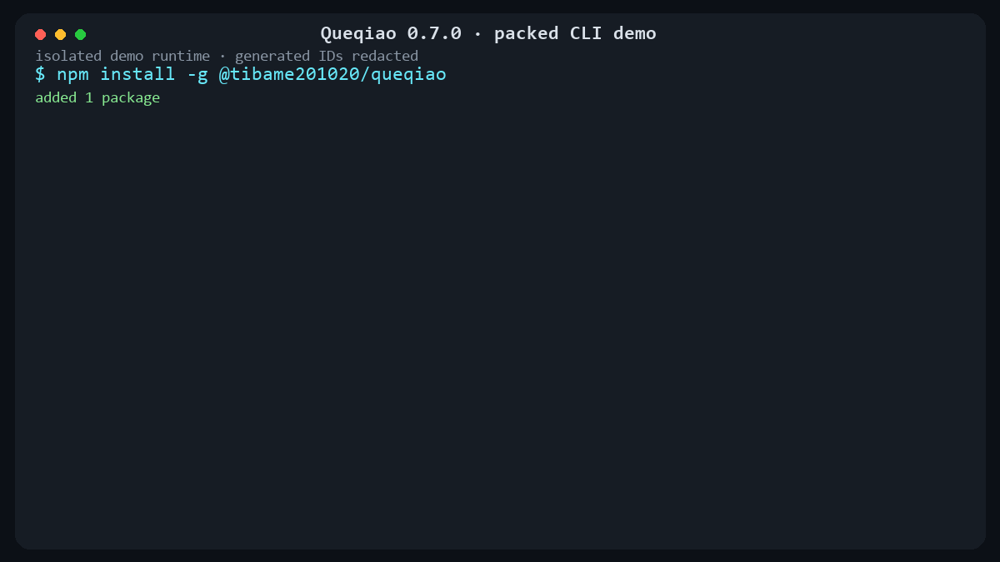

# Queqiao

[](https://github.com/tibame201020/Queqiao/actions/workflows/resource-safety.yml)
[](LICENSE)
[](https://www.npmjs.com/package/@tibame201020/queqiao)

Queqiao builds one secure bridge between AI clients and multiple coding environments.

The public MCP endpoint belongs to a lightweight Gateway. Windows, WSL, Linux, and
future remote environments each run their own Worker, so filesystem and process work
always executes inside the native environment.

## Quick CLI demo



The demo is rendered from commands executed against the packed `0.7.0` npm artifact in
an isolated Windows demo runtime. Generated worker IDs and process IDs are redacted;
the command results themselves come from the real CLI execution.

## Production architecture

- **Gateway** owns the public MCP endpoint, OAuth, stable tool schemas, routing, and
  worker health. It cannot read files or spawn workspace processes.
- **Worker** owns native execution and exposes only its environment-local Worker
  transport to the Gateway. The verified transport is loopback HTTP; Workers do not
  auto-register, maintain an idle registration connection, or expose a public MCP endpoint.
- **CLI** manages gateway, worker, workspace, tool, and command policy.
- **Protocol** contains versioned wire contracts and stable public tool names.
- **Security** owns identities, step-up challenges, approval grants, secret boundaries,
  and authentication adapters. OAuth is one adapter, not the security model itself.
- **Policy** is a pure authorization engine used by both Gateway and Worker.
- **Config** validates versioned configuration before it reaches a runtime module.
- **Tool runtime** registers bundled and optional typed tools through one
  transport-neutral extension contract with lifecycle sealing and interception hooks.
- **Workspace** provides bounded native filesystem primitives with containment and
  atomic mutation guarantees.

See [Architecture](docs/architecture.md) and the [architecture decisions](docs/adr/README.md).

## Project status

Queqiao is under active development. The **0.7.0** release baseline uses
**Core Manifest Revision 6** and **Worker Protocol 3.0**. Core exposes ten typed tools:
`workspace_info`, `list_workspaces`, `open_workspace`, `read_file`, `write_file`,
`edit_file`, `list_directory`, `search_text`, `run`, and `shell`. This release baseline also
enables the first-party Git extension with seven named typed tools, for a deterministic
17-tool public Deployment Manifest.

`workspace_info` may explicitly target a configured Workspace or use the deployment
default. `list_workspaces` includes a safe deployment-attestation projection containing
the Core Manifest Revision, Deployment Manifest Fingerprint, public tool count, Worker
Protocol Version, and bounded MCP compatibility window. OAuth still uses only the
`queqiao:access` handshake scope; Workspace profile/tool/command policy remains the
authority boundary.

`run` and `shell` support `mode: sync | async`. Async mode returns after native process
acceptance with a native PID and bounded lifetime while discarding stdout/stderr; it
does not introduce a Queqiao Job API, durable restart recovery, or tmux dependency.
Remote Streamable HTTP(S) MCP is the supported client transport. Queqiao currently pins
`2025-03-26`, `2025-06-18`, `2025-11-25`, and `2026-07-28` rather than inheriting an
unbounded SDK compatibility range.

The v0 public path was validated through ChatGPT on 2026-08-12. See the
[validation evidence](docs/validation/v0-chatgpt-2026-08-12.md).

Multiple configured workspaces were validated through the same public endpoint and
Windows Worker on 2026-08-12. See the
[multiple-workspaces evidence](docs/validation/multiple-workspaces-chatgpt-2026-08-12.md).

Native Windows and WSL Workers were validated through one connector and one Funnel on
2026-08-12. See the
[multi-environment evidence](docs/validation/multi-environment-chatgpt-2026-08-12.md).

Atomic CLI workspace updates and Worker hot reload were validated through the existing
connector without reconnecting on 2026-08-12. See the
[CLI hot-reload evidence](docs/validation/cli-workspace-hot-reload-chatgpt-2026-08-12.md).

Gateway environment registry hot reload and WSL-native CLI management were validated
through the existing connector without reconnecting on 2026-08-12. See the
[environment/WSL CLI evidence](docs/validation/cli-environment-wsl-chatgpt-2026-08-12.md).

Bidirectional tool permission hot reload was validated through the existing connector
without reconnecting on 2026-08-12. See the
[permission evidence](docs/validation/permission-hot-reload-chatgpt-2026-08-12.md).

The six-tool coding baseline, single OAuth handshake scope, atomic write, exact edit,
and readback loop were validated through ChatGPT on 2026-08-12. See the
[coding baseline evidence](docs/validation/coding-baseline-chatgpt-2026-08-12.md).

Manifest revision 2 is frozen. It adds the shell-free `run` tool without changing the
first six tool contracts. Native Windows and WSL execution, coding/editor profile
enforcement, command policy, and timeout termination were validated through ChatGPT.
See the [revision 2 evidence](docs/validation/run-manifest-v2-chatgpt-2026-08-12.md).

Manifest revision 3 is frozen. It appends
`list_directory` and `search_text` without changing the first seven contracts. Both
execute as bounded Worker-native primitives: no shell, no external command dependency,
no symlink traversal, and workspace policy remains authoritative. See the
[revision 3 evidence](docs/validation/filesystem-discovery-manifest-v3-chatgpt-2026-08-12.md).

Manifest revision 4 is frozen. It adds an explicit `shell` tool while keeping
the safer argv-only `run` contract unchanged. `shell` is fail-closed: it requires a
`coding` profile and an explicit workspace tool allow rule. Windows defaults to
PowerShell and may explicitly select cmd or Git Bash; Linux/WSL defaults to Bash. See
the [revision 4 evidence](docs/validation/native-shell-manifest-v4-chatgpt-2026-08-12.md).

Core Manifest Revision 5 introduced `mode: sync | async` on `run` and `shell` while
preserving bounded process policy and intentionally avoiding a durable Job abstraction. See
the [Revision 5 async evidence](docs/validation/core-manifest-revision-5-async-execution-2026-08-13.md).

Core Manifest Revision 6 makes `workspace_info` explicitly targetable by Workspace ID and
adds safe deployment attestation to `list_workspaces` without adding an eighteenth public
tool. See the [Revision 6 evidence](docs/validation/core-manifest-revision-6-workspace-attestation-2026-08-13.md).

Security Baseline v1 is frozen. OAuth replay protection, MCP request budgets, sanitized
health reporting, fail-closed Worker routing, native policy enforcement, filesystem and
process containment, and the documented adversarial matrix are enforced by required
Windows/Linux GitHub checks. See the
[security gate](docs/security/security-baseline-v1-gate.md) and
[threat matrix](docs/security/security-baseline-v1-threat-matrix.md).

Resource Safety Baseline v1 separately keeps the long-running Core lightweight. Windows
and Linux GitHub Actions run the packed npm artifact and bound resident-memory overhead,
idle CPU/write churn, request-log amplification, residual growth, descriptors/threads,
and process cleanup. Core PID accounting is intentionally separate from explicitly
authorized child workloads. See the
[resource safety contract](docs/resource-safety-baseline-v1.md) and
[initial stable audit evidence](docs/validation/resource-safety-baseline-v1-2026-08-14.md).

## CLI baseline

The current management CLI supports:

```text
queqiao gateway setup --name <gateway> --public-base-url <url> [--port <port>] [--management-port <port>]
queqiao gateway serve --name <gateway> [--bg]
queqiao gateway stop --name <gateway>
queqiao gateway status --name <gateway>
queqiao gateway join-token --name <gateway> [--expires <seconds>] [--copy]

queqiao worker setup --name <worker> [--port <port>]
queqiao worker port --name <worker> [--port <port>]
queqiao worker serve --name <worker> [--bg]
queqiao worker stop --name <worker>
queqiao worker status --name <worker>
queqiao worker join --name <worker>
queqiao worker list --name <gateway>
queqiao worker update --name <gateway> --worker-id <id> --endpoint <loopback-worker-url>
queqiao worker remove --name <gateway> --worker-id <id>

queqiao workspace add --worker <worker>
queqiao workspace list --worker <worker>
queqiao workspace remove --worker <worker> --id <id>
queqiao discovery list|add|remove
queqiao profile set --worker <worker> --workspace <id> --profile read-only|editor|coding
queqiao tool allow|deny --worker <worker> --workspace <id> --tool <tool>
queqiao command allow|deny --worker <worker> --workspace <id> --command <executable>
queqiao permissions show --worker <worker>
queqiao manifest show
queqiao extension list|doctor
queqiao tool explain <tool>
queqiao doctor
```

Discovery roots are optional read-only search scopes, never Workspace grants. Core Workspace authority is created only through explicit `workspace add --worker <name>` operations against an existing directory. Repository/worktree discovery and lifecycle semantics belong to the Git extension and never broaden the selected Workspace authority boundary.

Configuration changes use an exclusive lock, validated temporary file, and atomic
rename. A Worker validates every new root before replacing its in-memory catalog; a
rejected update leaves the last-known-good catalog active.

The same compiled CLI runs inside WSL with Linux-native XDG paths and explicit `serve`/`stop` lifecycle. Queqiao does not require or install a systemd user service for the Worker.

### First-time setup contract

There is deliberately no generic `queqiao setup`. Gateway, Worker, Workspace authority,
and enrollment are separate operations so no command silently broadens execution authority:

```text
queqiao gateway setup --name <gateway> --public-base-url <url>
queqiao worker setup --name <worker>
queqiao workspace add --worker <worker>
queqiao worker serve --name <worker> --bg
queqiao gateway serve --name <gateway> --bg
queqiao gateway join-token --name <gateway> --copy
queqiao worker join --name <worker>
```

`gateway setup` and `worker setup` create role-local state only. `workspace add` is the
separate authority grant for an existing directory. `worker join` is the separate atomic
membership transaction. `--bg` means a background process managed by Queqiao's explicit
PID-aware lifecycle; it is not an OS service, autostart entry, Run key, or systemd unit.

The mocked first-time setup flow and cross-platform Workspace-ID behavior are protected by
dedicated required GitHub checks on both Ubuntu and Windows:
`CLI setup flow (ubuntu-latest)` and `CLI setup flow (windows-latest)`. They run only after
the monorepo packages are typechecked/built, matching the dependency order required by the
workspace package graph.

## Runtime configuration

Queqiao never requires secrets or machine-specific paths inside the source checkout.
The bundled CLI resolves the platform layout and reports it with:

```powershell
npm run queqiao -- config paths
```

Installed from npm, set up each role explicitly and keep role-local state isolated by `--name`:

```shell
npm install --global @tibame201020/queqiao
queqiao gateway setup --name shadow --public-base-url https://example.invalid/shadow/
queqiao worker setup --name windows
queqiao workspace add --worker windows
queqiao worker serve --name windows --bg
queqiao gateway serve --name shadow --bg
queqiao gateway join-token --name shadow --copy
queqiao worker join --name windows
```

`gateway join-token --copy` copies a versioned join code that contains the Gateway public base URL plus the one-time enrollment token. Interactive `worker join` accepts that single join code. The join code is bearer-secret material and is only for Worker CLI → Gateway enrollment; it does not publish or authorize the Gateway → Worker runtime transport.

The package is self-contained and exposes independent Gateway and Worker process roles. Installing it does not create an OS service, autostart entry, Run key, or systemd unit. Runtime lifecycle is explicit:

```shell
queqiao gateway serve --name shadow --bg
queqiao gateway status --name shadow
queqiao gateway stop --name shadow

queqiao worker serve --name windows --bg
queqiao worker status --name windows
queqiao worker stop --name windows
```

Worker listeners remain loopback-only. Within one Gateway membership registry, each Gateway-visible Worker transport endpoint must be unique. If a Worker listener port must change, stop that Worker first, run `queqiao worker port --name <worker> --port <port>`, restart it, then update the Gateway membership transport with `queqiao worker update --name <gateway> --worker-id <id> --endpoint http://127.0.0.1:<port>/`.

On Windows, named Gateway and Worker layouts are stored below `%LOCALAPPDATA%\Queqiao\gateways\<name>` and `%LOCALAPPDATA%\Queqiao\workers\<name>`. Linux and WSL use the corresponding XDG role-scoped layout. Secrets remain separate files referenced by `config.yaml`; OAuth client registrations and other internal state remain implementation-owned data.

The frozen HTTP transport baseline permits only loopback Worker endpoints. Windows↔WSL localhost forwarding may make a WSL loopback Worker visible to the Windows Gateway through the Windows WSL relay, but Queqiao does not expose the Worker through the Gateway public base URL.

To migrate an older checkout safely, preview the non-overwriting plan and then execute it:

```powershell
npm run queqiao -- migrate from-repo --repo C:\path\to\Queqiao
npm run queqiao -- migrate from-repo --repo C:\path\to\Queqiao --execute
```

## Contributing and security

Contributions are welcome. See [CONTRIBUTING.md](CONTRIBUTING.md) for the development and validation workflow. Security issues should follow [SECURITY.md](SECURITY.md); do not disclose credentials or exploit details in a public issue. Queqiao is released under the [MIT License](LICENSE).

## Inspiration and independence

Queqiao was inspired by [Waishnav DevSpace](https://github.com/Waishnav/devspace) and
its approach to exposing selected local coding workspaces through MCP. Queqiao is an
independent implementation and is not affiliated with or endorsed by DevSpace.
