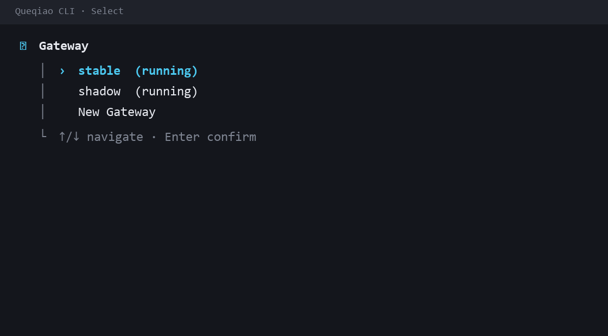
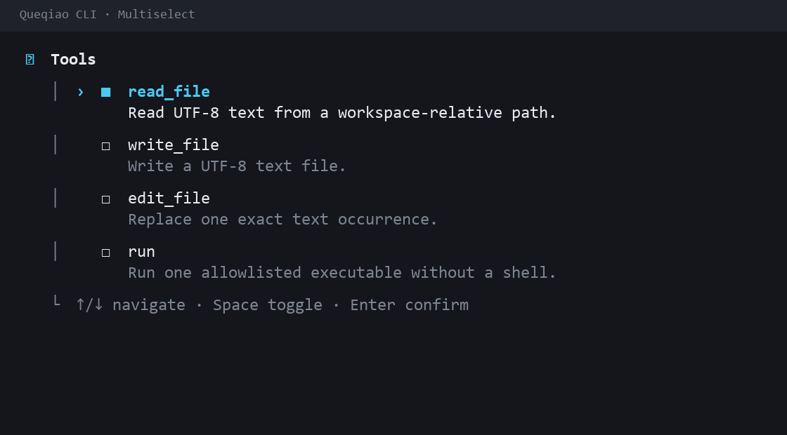
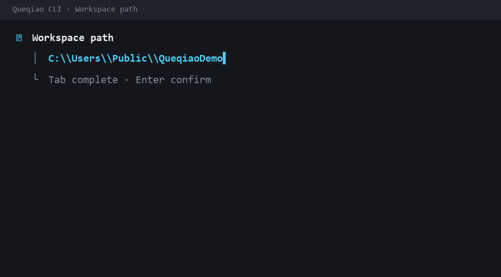
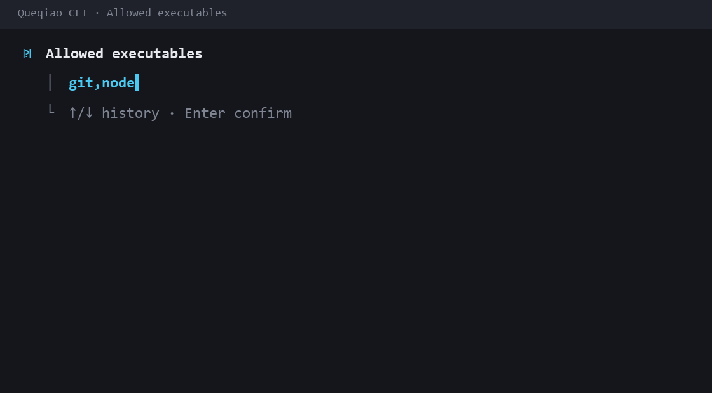
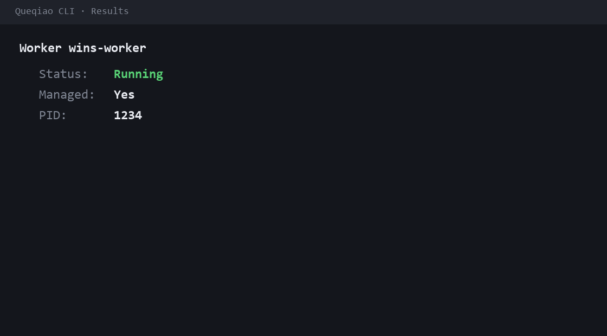
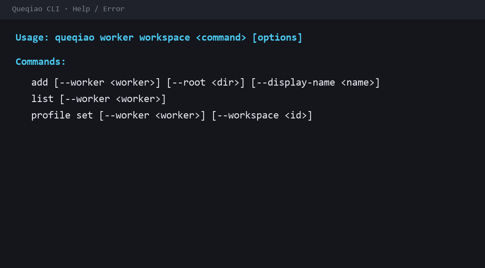

# CLI components

These GIFs document the reusable presentation primitives used by the production CLI. They are design/interaction evidence, not simulated command-success evidence. The generator lives at `scripts/cli-demo/render_components.py` and mirrors the glyph, hint, and semantic-color contract in `apps/cli/src/tui-theme.ts`.

## Select



Production owners:

- `apps/cli/src/tui-select.ts`
- `apps/cli/src/tui-choice-renderer.ts`
- `apps/cli/src/instance-selector.ts`

Contract:

- `›` is keyboard focus.
- The focused row is cyan/strong.
- Enter confirms.
- Existing identity is shown directly; action prefixes such as `Edit` or `Use` are not added when context already supplies the action.
- Creation sentinels use concise labels such as `New Gateway`.

## Multiselect



Production owners:

- `apps/cli/src/tui-multiselect.ts`
- `apps/cli/src/tui-choice-renderer.ts`
- `apps/cli/src/access-tool-prompt.ts`

Contract:

- `■` means selected; `□` means unselected.
- `›` remains independent keyboard focus.
- Space toggles the focused item; Enter confirms the set.
- Selected and focused descriptions remain readable; idle unselected descriptions may be muted.

## Workspace path input



Production owner:

- `apps/cli/src/workspace-path-prompt.ts`

Contract:

- The selected directory is explicit Workspace authority.
- Completion/navigation is presentation only; Queqiao never discovers a nearby repository and silently broadens authority.
- Workspace IDs are generated by Queqiao and are not interactive input.

## Command-history input



Production owner:

- `apps/cli/src/command-history-input.ts`

Contract:

- Executables are entered as a comma-separated allowlist.
- Entries are trimmed, normalized, and deduplicated by the CLI flow.
- Up/Down recalls local command-entry history.
- History is a user convenience and never expands Workspace authority by itself.

## Results and next action



Production owner:

- `apps/cli/src/cli-output.ts`

Contract:

- Human output is noun-first and uses a stable label/value hierarchy.
- Success is explicit with `✓`; color is supplemental rather than the only state signal.
- A suggested follow-up command is rendered as a separate `Next` section.
- `--json` output is never decorated or ANSI-styled.

## Help and error



Production owners:

- `apps/cli/src/command-surface.ts`
- `apps/cli/src/tui-theme.ts`

Contract:

- Help headings receive semantic emphasis while command grammar remains plain text.
- Interactive-only conveniences are represented with optional brackets in help, for example `[--worker <worker>]`.
- Non-TTY/JSON execution never opens an interactive selector; missing selectors fail with explicit guidance and exit code 2.
- Errors remain understandable with `NO_COLOR` or `TERM=dumb`.

## Regeneration

From the repository root on Windows:

```powershell
python scripts/cli-demo/render_components.py docs/assets/cli/components
```

After any TUI primitive change, regenerate the affected GIFs and run the presentation/help tests before updating documentation evidence.
