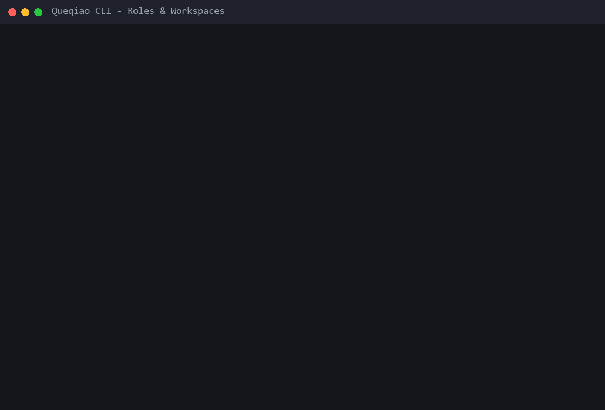
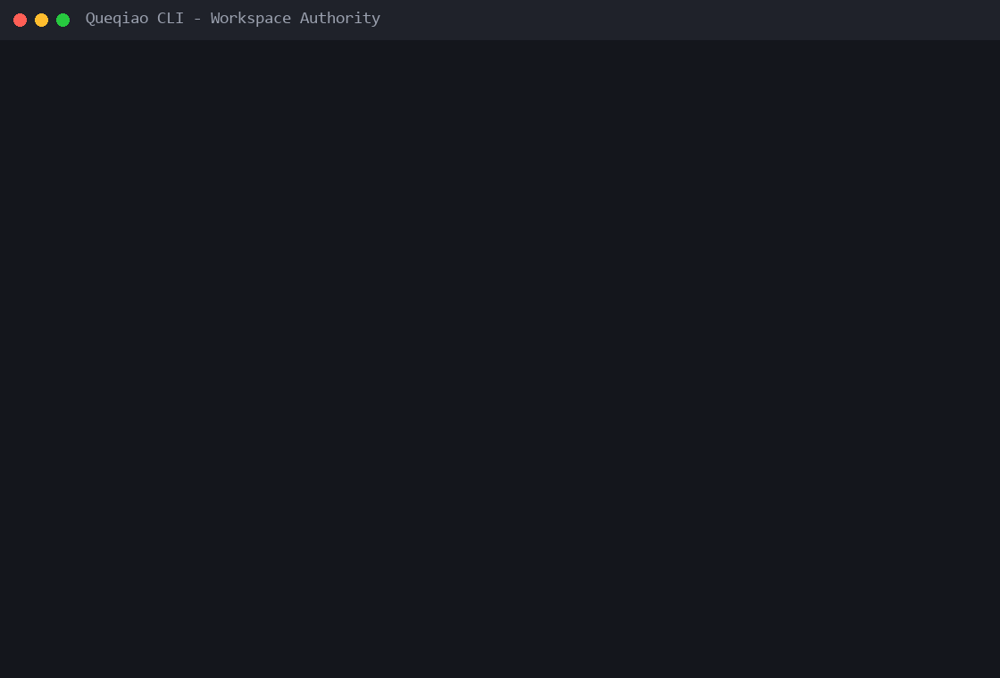
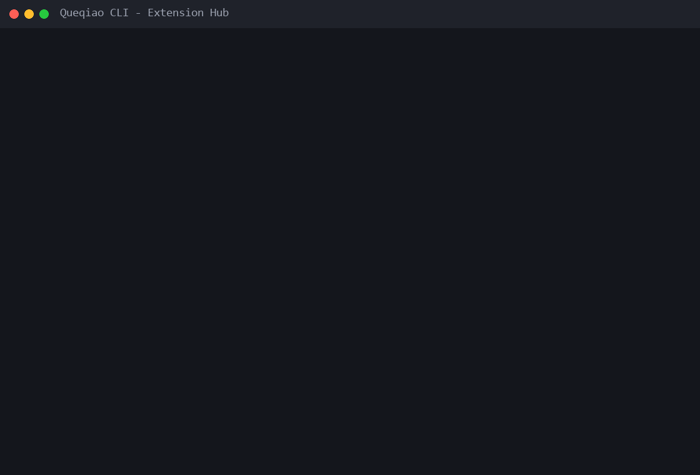
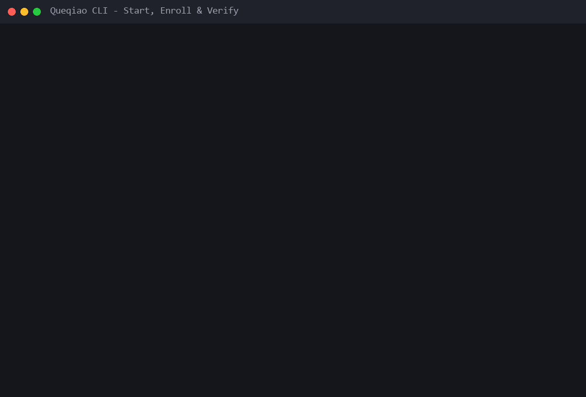

# CLI flows

These animations are recorded from a **real packed Queqiao package** installed into isolated synthetic runtime state. The recorder executes the packaged `queqiao` binary, captures real command output, redacts transient identifiers/secrets, and then renders the transcript as a deterministic terminal GIF.

The fixture itself is prepared through the production setup wizard API with deterministic prompt answers; no hidden setup flags are added to the public CLI just for documentation.

## Roles and Workspaces



The first flow verifies configured Gateway/Worker instances and the Workspaces owned by the Worker:

```text
queqiao gateway list
queqiao worker list
queqiao worker workspace list --worker demo-worker
```

## Workspace authority



A scriptable Workspace can be added with an explicit authority ceiling, then inspected through the Worker-owned permission projection:

```text
queqiao worker workspace add --worker demo-worker --root <path> --display-name "Demo App" --profile coding
queqiao worker workspace permissions show --worker demo-worker --workspace workspace-two
```

Interactive Workspace setup starts from the higher-level Access Profile UX (`Reader`, `Editor`, saved profiles, or `Custom`). See [CLI components](../components/README.md) for the select/multiselect/input interaction grammar.

## Extension Hub



Installation and Worker attachment remain separate operations:

```text
queqiao extension install <local-path> --json
queqiao extension attach dev.queqiao.demo --worker demo-worker --json
queqiao extension list
queqiao doctor extension
```

The demo package is synthetic and local to the isolated recording fixture. No registry package or user extension is modified.

## Start, enroll, and verify



This flow starts both managed runtimes, creates one short-lived self-contained join code, enrolls the Worker, then verifies membership and lifecycle status:

```text
queqiao worker serve --bg --worker demo-worker --json
queqiao gateway serve --bg --gateway demo-gateway --json
queqiao gateway join-token --gateway demo-gateway --expires 120 --json
queqiao worker join --worker demo-worker --join-code <redacted> --json
queqiao gateway workers list --gateway demo-gateway
queqiao gateway status --gateway demo-gateway
queqiao worker status --worker demo-worker
```

Join codes, credentials, PIDs, Worker IDs, user paths, and machine-specific identifiers are redacted before the transcript is rendered.

## Re-recording

On Windows, regenerate all production flow GIFs with:

```powershell
npm run docs:cli:flows
```

The recorder lives at `scripts/cli-demo/record.ps1`. It:

1. builds the package into a staging directory without touching the live Shadow `dist/`;
2. creates an npm tarball from that staged package;
3. installs the tarball into an isolated npm prefix;
4. prepares synthetic Gateway/Worker/Workspace/Extension state;
5. executes the packed public CLI for every recorded step;
6. redacts sensitive or machine-specific values;
7. renders `docs/assets/cli/flows/*.gif` from the captured transcripts.

Generated transcripts and package staging data are implementation evidence, not release assets.

## Recording gate

A flow GIF is publishable only when all of these hold:

1. The command sequence ran against the packed/installable Queqiao artifact from the same source revision.
2. The command/help grammar matches the checked-in production CLI.
3. Runtime/config state is isolated and synthetic.
4. Join codes, OAuth material, credentials, PIDs, real user paths, public endpoints, and other machine-specific identifiers are absent or deterministically redacted.
5. The animation does not synthesize a success result that the command did not produce.
6. The asset is legible at normal GitHub documentation width.
