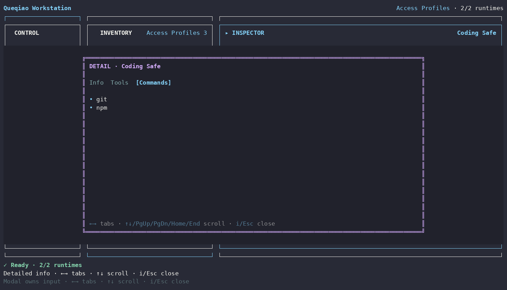

# Access Profile Detailed Info

[Detailed Info 索引](README.zh-TW.md) · [English](access-profile.md)

| Tab | 顯示內容 |
| --- | --- |
| **Info** | profile name、built-in/custom type、detached-template semantics |
| **Tools** | profile 保存的 Tool allowlist |
| **Commands** | profile 保存的 executable-command allowlist |

Built-in profile immutable。Custom profile 只是 reusable template；套用時把 authority 複製到 Workspace，不建立 live reference。

Custom profile mutation 留在 Inspector：**Edit Profile**、**Rename Profile**、**Delete Profile**；domain level 可建立新 profile。
