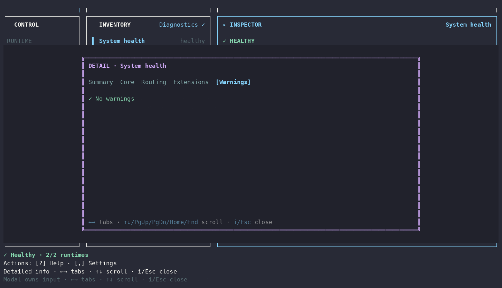

# Diagnostics Detailed Info

[Detailed Info index](README.md) · [繁體中文](diagnostics.zh-TW.md)

| Tab | What it shows |
| --- | --- |
| **Summary** | overall healthy/issue state plus counts for Core checks, routes, and warnings |
| **Core** | configured local Gateway/Worker runtime checks with state, detail, and remediation |
| **Routing** | Gateway-authoritative enrolled Worker reachability/routing checks |
| **Extensions** | Extension Hub health, Extension/Worker counts, and integrity issues |
| **Warnings** | consolidated remediation-oriented warnings; healthy state explicitly reports no warnings |

Diagnostics renders the authoritative `doctorQueqiao()` model rather than maintaining a Workstation-only health system. **Run diagnostics** remains an immediate Inspector action and refreshes this view from the same underlying checks.
