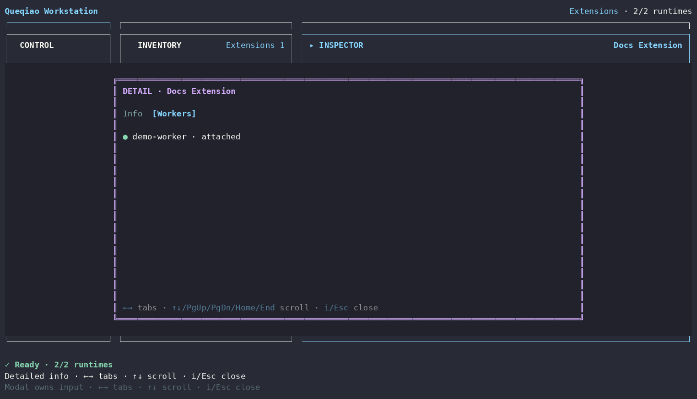

# Extension Detailed Info

[Detailed Info index](README.md) · [繁體中文](extension.zh-TW.md)

| Tab | What it shows |
| --- | --- |
| **Info** | Extension display name, id, version, and package/source identity |
| **Workers** | every Worker attachment record, explicitly marked attached or not attached |

Installation and Worker attachment are separate. An installed Extension does not automatically become active on every Worker, and attachment still does not replace Workspace authority checks.

Attach/Detach actions remain in Inspector. Uninstall uses the supported attachment/destructive flow rather than being hidden inside Detailed Info.
