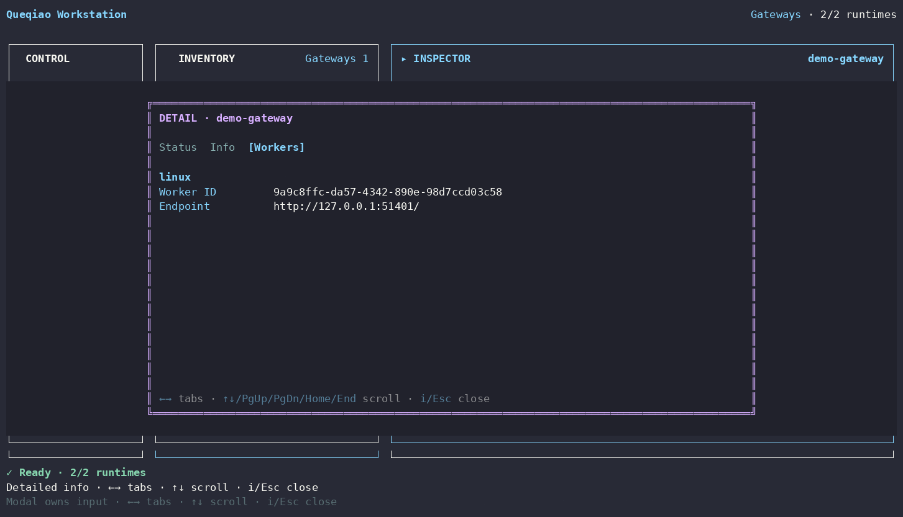

# Gateway Detailed Info

[Detailed Info index](README.md) · [繁體中文](gateway.zh-TW.md)

| Tab | What it shows |
| --- | --- |
| **Status** | runtime active/managed state, PID when available, health/reachability, HTTP status, identity match, and probe error when relevant |
| **Info** | Gateway name, lifecycle, managed state, public URL, service port, and local management port |
| **Workers** | Gateway-authoritative enrolled Worker membership: environment id, Worker id, and transport endpoint |

A stopped Gateway is rendered as **stopped**, not as a generic unreachable failure. Worker membership detail is loaded lazily for the selected Gateway and is not re-fetched on every periodic inventory refresh.

Mutations remain in the Gateway Inspector: Start/Stop, Configure, Copy MCP URL, Copy approval secret, Manage Workers, Create join code, and Remove Gateway.
