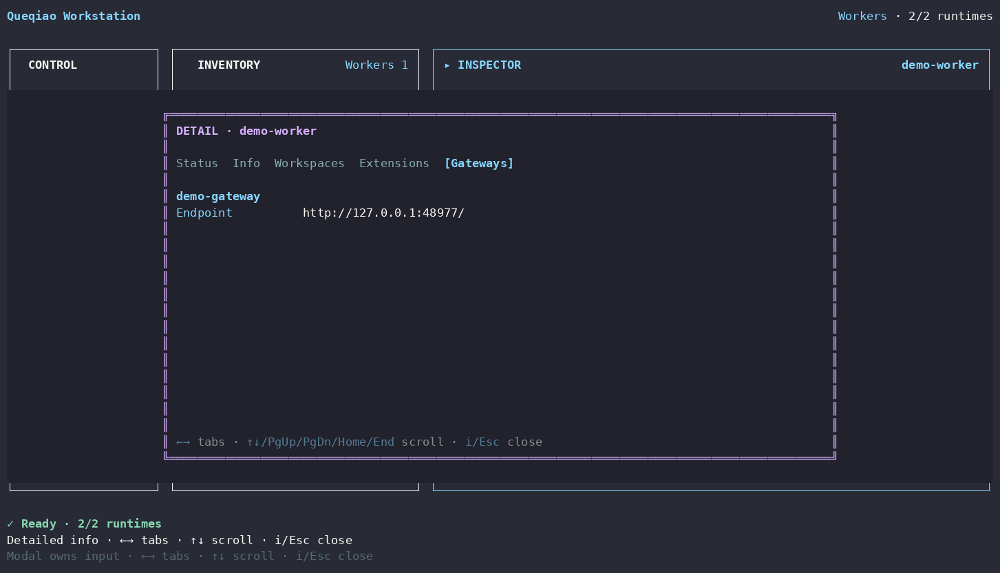

# Worker Detailed Info

[Detailed Info index](README.md) · [繁體中文](worker.zh-TW.md)

| Tab | What it shows |
| --- | --- |
| **Status** | runtime active/managed state, PID when available, health/reachability, HTTP status, identity match, and probe error when relevant |
| **Info** | Worker name, lifecycle, managed state, and native endpoint |
| **Workspaces** | each authorized Workspace: display name, id, root, and persisted profile marker |
| **Extensions** | Extensions attached to this Worker: display name, id, version |
| **Gateways** | persisted/known Gateway relationships and endpoint when available |

Cross-OS ownership remains explicit: Workstation reports the relationships available from local persisted state rather than inventing an upstream Gateway relationship.

Mutations remain in the Worker Inspector: Start/Stop, Configure, Add Workspace, Join Gateway, and Remove Worker.
