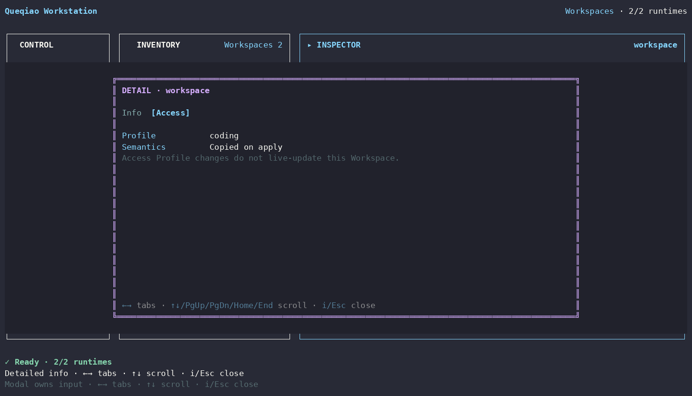

# Workspace Detailed Info

[Detailed Info index](README.md) · [繁體中文](workspace.zh-TW.md)

| Tab | What it shows |
| --- | --- |
| **Info** | Workspace display name, id, owning Worker, and absolute root |
| **Access** | persisted profile marker and the key semantic that profile authority is copied on apply |

A Workspace is the actual Worker-owned authority boundary. Access Profile changes do not live-update it; editing the source profile later cannot silently change an already persisted Workspace.

Workspace mutation remains in Inspector actions: **Edit Workspace** and **Remove Workspace**. Removing the last Workspace of a configured Worker is blocked.
